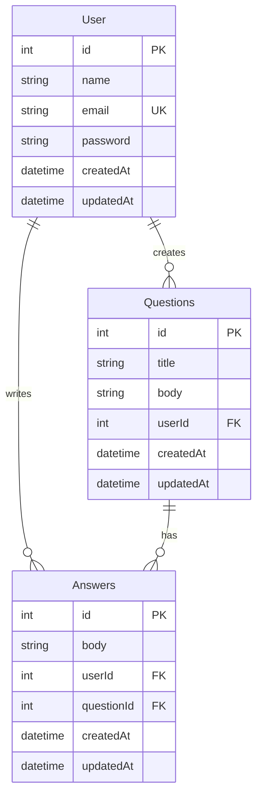

# Learning Nest

API REST de perguntas e respostas construída com **NestJS**, **Prisma** e **SQLite**. Projeto de estudo para aprender os fundamentos do framework: módulos, controllers, services, DTOs, validação, autenticação JWT e tratamento de erros.

---

## Índice

- [Sobre o projeto](#sobre-o-projeto)
- [Tecnologias](#tecnologias)
- [Arquitetura](#arquitetura)
- [Modelo de dados](#modelo-de-dados)
- [Pré-requisitos](#pré-requisitos)
- [Como rodar](#como-rodar)
- [Variáveis de ambiente](#variáveis-de-ambiente)
- [Autenticação](#autenticação)
- [Endpoints da API](#endpoints-da-api)
- [Validação de entrada](#validação-de-entrada)
- [Tratamento de erros](#tratamento-de-erros)
- [Testando com Thunder Client](#testando-com-thunder-client)
- [Scripts disponíveis](#scripts-disponíveis)
- [Conceitos NestJS usados neste projeto](#conceitos-nestjs-usados-neste-projeto)

---

## Sobre o projeto

Esta API permite:

1. **Cadastrar usuários** com email e senha forte
2. **Fazer login** e receber um token JWT
3. **Criar perguntas** (autenticado)
4. **Responder perguntas** (autenticado)
5. **Consultar, atualizar e remover** usuários, perguntas e respostas

Fluxo típico:

```
Signup → Sign-in → recebe token → usa token nas rotas protegidas
```

---

## Tecnologias

| Tecnologia | Uso |
|------------|-----|
| [NestJS 11](https://nestjs.com/) | Framework backend (módulos, DI, guards, pipes) |
| [Prisma 7](https://www.prisma.io/) | ORM e migrations |
| [SQLite](https://www.sqlite.org/) | Banco de dados local |
| [JWT](https://jwt.io/) | Autenticação stateless |
| [Argon2](https://github.com/ranisalt/node-argon2) | Hash de senhas |
| [class-validator](https://github.com/typestack/class-validator) | Validação de DTOs |

---

## Arquitetura

```
src/
├── main.ts                 # Bootstrap da aplicação + ValidationPipe global
├── app.module.ts           # Módulo raiz
├── auth/                   # Login, JWT, AuthGuard
│   ├── dto/
│   ├── interfaces/
│   └── types/
├── users/                  # Cadastro e CRUD de usuários
│   └── dto/
├── questions/              # CRUD de perguntas
│   └── dto/
├── answers/                # CRUD de respostas
│   └── dto/
└── database/               # PrismaService (conexão com o banco)
```

### Camadas de cada feature

```
HTTP Request
     ↓
Controller   → recebe request, chama service
     ↓
Guard        → protege rotas (JWT) — quando aplicável
     ↓
DTO          → valida body (ValidationPipe)
     ↓
Service      → regra de negócio + Prisma
     ↓
Prisma       → banco SQLite
```

---

## Modelo de dados



---

## Pré-requisitos

- **Node.js** 18+
- **npm**

---

## Como rodar

### 1. Instalar dependências

```bash
npm install
```

### 2. Configurar variáveis de ambiente

Copie o exemplo e preencha os valores:

```bash
cp .env.example .env
```

Exemplo de `.env`:

```env
DATABASE_URL="file:./dev.db"
SECRET_KEY="sua-chave-secreta-aqui"
PORT=3000
```

### 3. Rodar migrations do Prisma

```bash
npx prisma migrate dev
```

### 4. Subir o servidor

```bash
# desenvolvimento (hot reload)
npm run start:dev

# produção
npm run build
npm run start:prod
```

A API ficará disponível em `http://localhost:3000` (ou na porta definida em `PORT`).

---

## Variáveis de ambiente

| Variável | Obrigatória | Descrição |
|----------|-------------|-----------|
| `DATABASE_URL` | Sim | Connection string do SQLite (ex: `file:./dev.db`) |
| `SECRET_KEY` | Sim | Chave secreta para assinar e validar JWTs |
| `PORT` | Não | Porta do servidor (padrão: `3000`) |

> **Importante:** nunca commite o arquivo `.env` com chaves reais.

---

## Autenticação

### Sign-up

Cadastro público em `POST /users/signup`. A senha é hasheada com **Argon2** antes de ir para o banco. A resposta **nunca** inclui o campo `password`.

### Sign-in

Login em `POST /auth/sign-in`. Retorna:

```json
{
  "access_token": "eyJhbGciOiJIUzI1NiIs..."
}
```

O payload do token contém `{ sub: userId }`, onde `sub` é o ID do usuário.

### Rotas protegidas

Rotas com `@UseGuards(AuthGuard)` exigem o header:

```
Authorization: Bearer <access_token>
```

O `AuthGuard`:

1. Extrai o token do header
2. Valida com `JwtService.verifyAsync`
3. Anexa o payload decodificado em `request.user`
4. Nos controllers protegidos, use `req.user.sub` para obter o ID do usuário logado

Token expira em **30 minutos** (`1800s`), configurado no `AuthModule`.

---

## Endpoints da API

Legenda: 🔓 público · 🔒 requer JWT

### Auth

| Método | Rota | Auth | Descrição |
|--------|------|------|-----------|
| `POST` | `/auth/sign-in` | 🔓 | Login |

### Users

| Método | Rota | Auth | Descrição |
|--------|------|------|-----------|
| `POST` | `/users/signup` | 🔓 | Cadastro |
| `GET` | `/users/:id` | 🔒 | Buscar usuário por ID |
| `PATCH` | `/users/:id` | 🔒 | Atualizar usuário |
| `DELETE` | `/users/:id` | 🔒 | Remover usuário |

### Questions

| Método | Rota | Auth | Descrição |
|--------|------|------|-----------|
| `POST` | `/questions` | 🔒 | Criar pergunta |
| `GET` | `/questions` | 🔒 | Listar perguntas |
| `GET` | `/questions/:id` | 🔒 | Buscar pergunta |
| `PATCH` | `/questions/:id` | 🔒 | Atualizar pergunta |
| `DELETE` | `/questions/:id` | 🔒 | Remover pergunta |

### Answers

| Método | Rota | Auth | Descrição |
|--------|------|------|-----------|
| `POST` | `/answers/:questionId` | 🔒 | Criar resposta em uma pergunta |
| `GET` | `/answers` | 🔒 | Listar respostas |
| `GET` | `/answers/:id` | 🔒 | Buscar resposta |
| `PATCH` | `/answers/:id` | 🔒 | Atualizar resposta |
| `DELETE` | `/answers/:id` | 🔒 | Remover resposta |

---

## Validação de entrada

Validação global configurada no `main.ts` com `ValidationPipe`:

- `whitelist` — remove campos não declarados no DTO
- `forbidNonWhitelisted` — rejeita campos extras
- `transform` — converte JSON em instância da classe DTO

### Sign-up (`CreateUserDto`)

| Campo | Regras |
|-------|--------|
| `name` | string, obrigatório |
| `email` | email válido |
| `password` | mín. 8 caracteres, 1 maiúscula, 1 número, 1 símbolo |

Exemplo de senha válida: `Senha123#`

### Sign-in (`SignInDto`)

| Campo | Regras |
|-------|--------|
| `email` | email válido |
| `password` | string, obrigatório |

---

## Tratamento de erros

Erros de negócio são lançados nos **services** usando exceptions do NestJS:

| Exception | HTTP | Exemplo |
|-----------|------|---------|
| `BadRequestException` | 400 | DTO inválido (ValidationPipe) |
| `UnauthorizedException` | 401 | Token inválido / credenciais incorretas |
| `NotFoundException` | 404 | Recurso não encontrado |
| `ConflictException` | 409 | Email já cadastrado |

### Erros do Prisma tratados

| Código Prisma | Situação | Resposta |
|---------------|----------|----------|
| `P2002` | Violação de unique (email duplicado) | 409 Conflict |
| `P2003` | Foreign key inválida (user/question inexistente) | 404 Not Found |
| `P2025` | Update/delete em registro inexistente | 404 Not Found |

### `findOne` vs `update`/`delete`

- **`findUnique`** retorna `null` → checar manualmente e lançar `NotFoundException`
- **`update`/`delete`** lançam `P2025` → capturar no `try/catch`

Exemplo de resposta de erro:

```json
{
  "statusCode": 409,
  "message": "Email already registered",
  "error": "Conflict"
}
```

---

## Testando com Thunder Client

### 1. Cadastro

```
POST http://localhost:3000/users/signup
Content-Type: application/json

{
  "name": "João",
  "email": "joao@email.com",
  "password": "Senha123#"
}
```

### 2. Login

```
POST http://localhost:3000/auth/sign-in
Content-Type: application/json

{
  "email": "joao@email.com",
  "password": "Senha123#"
}
```

Copie o `access_token` da resposta.

### 3. Criar pergunta

```
POST http://localhost:3000/questions
Authorization: Bearer <access_token>
Content-Type: application/json

{
  "title": "Como funciona JWT?",
  "body": "Preciso entender o fluxo de autenticação."
}
```

### 4. Criar resposta

```
POST http://localhost:3000/answers/1
Authorization: Bearer <access_token>
Content-Type: application/json

{
  "body": "JWT é um token assinado que identifica o usuário."
}
```

---

## Scripts disponíveis

| Comando | Descrição |
|---------|-----------|
| `npm run start:dev` | Servidor em modo watch |
| `npm run build` | Compila TypeScript |
| `npm run start:prod` | Roda build de produção |
| `npm run test` | Testes unitários |
| `npm run test:e2e` | Testes end-to-end |
| `npm run lint` | ESLint |

### Prisma

| Comando | Descrição |
|---------|-----------|
| `npx prisma migrate dev` | Aplica migrations |
| `npx prisma studio` | Interface visual do banco |

---

## Conceitos NestJS usados neste projeto

| Conceito | Onde aparece |
|----------|--------------|
| **Module** | `AppModule`, `AuthModule`, `UserModule`, etc. |
| **Controller** | Rotas HTTP (`@Controller`, `@Get`, `@Post`…) |
| **Service** | Lógica de negócio + acesso ao banco |
| **DTO** | Validação de entrada (`CreateUserDto`, `SignInDto`) |
| **Pipe** | `ValidationPipe` global |
| **Guard** | `AuthGuard` — proteção JWT |
| **Dependency Injection** | Services injetados via constructor |
| **Provider** | `PrismaService`, `AuthService`, etc. |

---

## Licença

Projeto privado — uso educacional.
