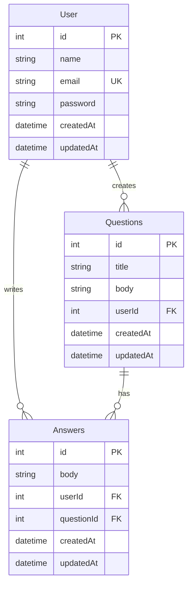

# Learning Nest

API REST de perguntas e respostas construída com **NestJS**, **Prisma** e **SQLite**. Projeto de estudo para aprender os fundamentos do framework: módulos, controllers, services, DTOs, validação, autenticação JWT, autorização e tratamento de erros.

---

## Índice

- [Sobre o projeto](#sobre-o-projeto)
- [Tecnologias](#tecnologias)
- [Arquitetura](#arquitetura)
- [Modelo de dados](#modelo-de-dados)
- [Pré-requisitos](#pré-requisitos)
- [Como rodar](#como-rodar)
- [Variáveis de ambiente](#variáveis-de-ambiente)
- [Autenticação](#autenticação)
- [Autorização (dono do recurso)](#autorização-dono-do-recurso)
- [Endpoints da API](#endpoints-da-api)
- [Validação de entrada](#validação-de-entrada)
- [Tratamento de erros](#tratamento-de-erros)
- [Testando com Thunder Client](#testando-com-thunder-client)
- [Scripts disponíveis](#scripts-disponíveis)
- [Conceitos NestJS usados neste projeto](#conceitos-nestjs-usados-neste-projeto)

---

## Sobre o projeto

Esta API permite:

1. **Cadastrar usuários** com email e senha forte
2. **Fazer login** e receber um token JWT
3. **Criar perguntas** vinculadas ao usuário logado
4. **Responder perguntas** vinculando resposta ao usuário e à pergunta
5. **Consultar, atualizar e remover** usuários, perguntas e respostas
6. **Restringir edição/exclusão** apenas ao dono do recurso

Fluxo típico:

```
Signup → Sign-in → recebe token → usa token nas rotas protegidas
```

---

## Tecnologias

| Tecnologia | Uso |
|------------|-----|
| [NestJS 11](https://nestjs.com/) | Framework backend (módulos, DI, guards, pipes) |
| [Prisma 7](https://www.prisma.io/) | ORM e migrations |
| [SQLite](https://www.sqlite.org/) | Banco de dados local |
| [JWT](https://jwt.io/) | Autenticação stateless |
| [Argon2](https://github.com/ranisalt/node-argon2) | Hash de senhas |
| [class-validator](https://github.com/typestack/class-validator) | Validação de DTOs |

---

## Arquitetura

```
src/
├── main.ts                 # Bootstrap + ValidationPipe global
├── app.module.ts           # Módulo raiz
├── auth/                   # Login, JWT, AuthGuard
│   ├── dto/                # SignInDto
│   ├── interfaces/         # AuthenticatedRequest
│   └── types/              # JwtPayload
├── users/                  # Cadastro e CRUD de usuários
│   └── dto/                # CreateUserDto
├── questions/              # CRUD de perguntas
│   └── dto/
├── answers/                # CRUD de respostas
│   └── dto/
└── database/               # PrismaService
```

### Camadas de cada feature

```
HTTP Request
     ↓
Controller   → recebe request, extrai params e req.user
     ↓
Guard        → autentica JWT (401 se inválido)
     ↓
DTO          → valida body (400 se inválido)
     ↓
Service      → autorização (403) + regra de negócio + Prisma
     ↓
Prisma       → banco SQLite
```

### Tipagem da request autenticada

| Arquivo | Função |
|---------|--------|
| `JwtPayload` | Formato do conteúdo decodificado do JWT (`sub`, `iat`, `exp`) |
| `AuthenticatedRequest` | `Request` do Express + `user: JwtPayload` |
| `AuthGuard` | Valida token e preenche `request.user` |

Nos controllers protegidos, use `req.user.sub` para obter o ID do usuário logado.

---

## Modelo de dados



---

## Pré-requisitos

- **Node.js** 18+
- **npm**

---

## Como rodar

### 1. Instalar dependências

```bash
npm install
```

### 2. Configurar variáveis de ambiente

```bash
cp .env.example .env
```

Exemplo de `.env`:

```env
DATABASE_URL="file:./dev.db"
SECRET_KEY="sua-chave-secreta-aqui"
PORT=3000
```

### 3. Rodar migrations do Prisma

```bash
npx prisma migrate dev
```

### 4. Subir o servidor

```bash
npm run start:dev
```

A API ficará disponível em `http://localhost:3000` (ou na porta definida em `PORT`).

---

## Variáveis de ambiente

| Variável | Obrigatória | Descrição |
|----------|-------------|-----------|
| `DATABASE_URL` | Sim | Connection string do SQLite (ex: `file:./dev.db`) |
| `SECRET_KEY` | Sim | Chave secreta para assinar e validar JWTs |
| `PORT` | Não | Porta do servidor (padrão: `3000`) |

> **Importante:** nunca commite o arquivo `.env` com chaves reais.

---

## Autenticação

### Sign-up

Cadastro público em `POST /users/signup`. A senha é hasheada com **Argon2**. A resposta **nunca** inclui o campo `password`.

### Sign-in

Login em `POST /auth/sign-in`. Retorna:

```json
{
  "access_token": "eyJhbGciOiJIUzI1NiIs..."
}
```

O payload do token contém `{ sub: userId }`. Token expira em **30 minutos** (`1800s`).

### Rotas protegidas

Header obrigatório:

```
Authorization: Bearer <access_token>
```

O `AuthGuard` valida o token e anexa o payload em `request.user`.

---

## Autorização (dono do recurso)

Autenticação responde **"quem é você?"**. Autorização responde **"você pode fazer isso neste recurso?"**.

| Situação | HTTP |
|----------|------|
| Sem token / token inválido | 401 Unauthorized |
| Logado, mas não é o dono | **403 Forbidden** |
| Recurso não existe | 404 Not Found |

### Regras implementadas

| Recurso | PATCH / DELETE |
|---------|----------------|
| **Users** | Só o próprio usuário (`:id` === `req.user.sub`) |
| **Questions** | Só quem criou (`question.userId === req.user.sub`) |
| **Answers** | Só quem respondeu (`answer.userId === req.user.sub`) |

### De onde vem cada dado no create

| Campo | Origem |
|-------|--------|
| `body` do DTO | Cliente envia no JSON |
| `userId` | `req.user.sub` (token — nunca confiar no body) |
| `questionId` (answers) | URL (`POST /answers/:questionId`) |

---

## Endpoints da API

Legenda: 🔓 público · 🔒 requer JWT · ✏️ só o dono (PATCH/DELETE)

### Auth

| Método | Rota | Auth | Descrição |
|--------|------|------|-----------|
| `POST` | `/auth/sign-in` | 🔓 | Login |

### Users

| Método | Rota | Auth | Descrição |
|--------|------|------|-----------|
| `POST` | `/users/signup` | 🔓 | Cadastro |
| `GET` | `/users/:id` | 🔒 | Buscar usuário |
| `PATCH` | `/users/:id` | 🔒 ✏️ | Atualizar própria conta |
| `DELETE` | `/users/:id` | 🔒 ✏️ | Remover própria conta |

### Questions

| Método | Rota | Auth | Descrição |
|--------|------|------|-----------|
| `POST` | `/questions` | 🔒 | Criar pergunta |
| `GET` | `/questions` | 🔒 | Listar perguntas |
| `GET` | `/questions/:id` | 🔒 | Buscar pergunta |
| `PATCH` | `/questions/:id` | 🔒 ✏️ | Atualizar própria pergunta |
| `DELETE` | `/questions/:id` | 🔒 ✏️ | Remover própria pergunta |

### Answers

| Método | Rota | Auth | Descrição |
|--------|------|------|-----------|
| `POST` | `/answers/:questionId` | 🔒 | Criar resposta |
| `GET` | `/answers` | 🔒 | Listar respostas |
| `GET` | `/answers/:id` | 🔒 | Buscar resposta |
| `PATCH` | `/answers/:id` | 🔒 ✏️ | Atualizar própria resposta |
| `DELETE` | `/answers/:id` | 🔒 ✏️ | Remover própria resposta |

---

## Validação de entrada

`ValidationPipe` global no `main.ts`:

- `whitelist` — remove campos não declarados no DTO
- `forbidNonWhitelisted` — rejeita campos extras
- `transform` — converte JSON em instância da classe DTO

> **Importante:** com `forbidNonWhitelisted: true`, todo campo do DTO precisa de decorators do `class-validator` (`@IsString()`, etc.). Sem decorators, campos válidos como `title` e `body` retornam `"property X should not exist"`.

### Sign-up (`CreateUserDto`)

| Campo | Regras |
|-------|--------|
| `name` | string, obrigatório |
| `email` | email válido |
| `password` | mín. 8 chars, 1 maiúscula, 1 número, 1 símbolo |

Exemplo: `Senha123#`

### Sign-in (`SignInDto`)

| Campo | Regras |
|-------|--------|
| `email` | email válido |
| `password` | string, obrigatório |

### Create question (`CreateQuestionDto`)

| Campo | Regras |
|-------|--------|
| `title` | string, obrigatório, máx. 20 caracteres |
| `body` | string, obrigatório, mín. 10, máx. 200 caracteres |

### Create answer (`CreateAnswerDto`)

| Campo | Regras |
|-------|--------|
| `body` | string, obrigatório, máx. 200 caracteres |

---

## Tratamento de erros

Exceptions usadas nos **services**:

| Exception | HTTP | Quando |
|-----------|------|--------|
| `BadRequestException` | 400 | DTO inválido (ValidationPipe) |
| `UnauthorizedException` | 401 | Token inválido / credenciais incorretas |
| `ForbiddenException` | 403 | Logado, mas não é dono do recurso |
| `NotFoundException` | 404 | Recurso não encontrado |
| `ConflictException` | 409 | Email já cadastrado |

### Códigos Prisma tratados

| Código | Situação | HTTP |
|--------|----------|------|
| `P2002` | Unique violado (email duplicado) | 409 |
| `P2003` | Foreign key inválida | 404 |
| `P2025` | Update/delete em registro inexistente | 404 |

### `findOne` vs `update`/`delete`

- **`findUnique`** → retorna `null` → checar e lançar `NotFoundException`
- **`update`/`delete`** → lançam `P2025` → capturar no `try/catch`

---

## Testando com Thunder Client

### Setup — dois usuários

1. Cadastre **Alice** e **Bob** via `POST /users/signup`
2. Faça login dos dois via `POST /auth/sign-in`
3. Guarde **TOKEN_A** e **TOKEN_B**

Header em rotas protegidas:

```
Authorization: Bearer <token>
Content-Type: application/json
```

### Fluxo básico

**Signup:**
```json
{ "name": "Alice", "email": "alice@email.com", "password": "Senha123#" }
```

**Login:**
```json
{ "email": "alice@email.com", "password": "Senha123#" }
```

**Criar pergunta** (`POST /questions`):
```json
{ "title": "Como funciona JWT?", "body": "Preciso entender autenticação no NestJS." }
```

**Criar resposta** (`POST /answers/1`):
```json
{ "body": "JWT identifica o usuário logado via token Bearer." }
```

### Testar autorização (403)

| Teste | Token | Esperado |
|-------|-------|----------|
| Bob edita pergunta da Alice | TOKEN_B | 403 |
| Bob apaga resposta da Alice | TOKEN_B | 403 |
| Bob edita perfil da Alice (`PATCH /users/1`) | TOKEN_B | 403 |
| Alice edita própria pergunta | TOKEN_A | 200 |
| Alice apaga própria resposta | TOKEN_A | 200 |

### Outros erros úteis

| Teste | Esperado |
|-------|----------|
| Request sem `Authorization` | 401 |
| Email duplicado no signup | 409 |
| Senha fraca no signup | 400 |
| `GET /questions/9999` | 404 |
| Body com campo extra (`isAdmin: true`) | 400 |

---

## Scripts disponíveis

| Comando | Descrição |
|---------|-----------|
| `npm run start:dev` | Servidor em modo watch |
| `npm run build` | Compila TypeScript |
| `npm run start:prod` | Roda build de produção |
| `npm run test` | Testes unitários |
| `npm run test:e2e` | Testes end-to-end |
| `npm run lint` | ESLint |

### Prisma

| Comando | Descrição |
|---------|-----------|
| `npx prisma migrate dev` | Aplica migrations |
| `npx prisma studio` | Interface visual do banco |

---

## Conceitos NestJS usados neste projeto

| Conceito | Onde aparece |
|----------|--------------|
| **Module** | `AppModule`, `AuthModule`, `UserModule`, etc. |
| **Controller** | Rotas HTTP |
| **Service** | Regras de negócio, autorização, Prisma |
| **DTO** | Contrato e validação de entrada |
| **Pipe** | `ValidationPipe` global |
| **Guard** | `AuthGuard` — autenticação JWT |
| **Autorização** | Checagem de dono nos services (`ForbiddenException`) |
| **DI** | Services injetados via constructor |

---

## Licença

Projeto privado — uso educacional.
